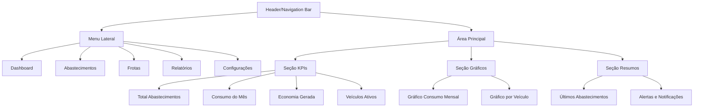
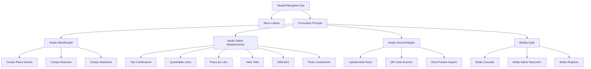
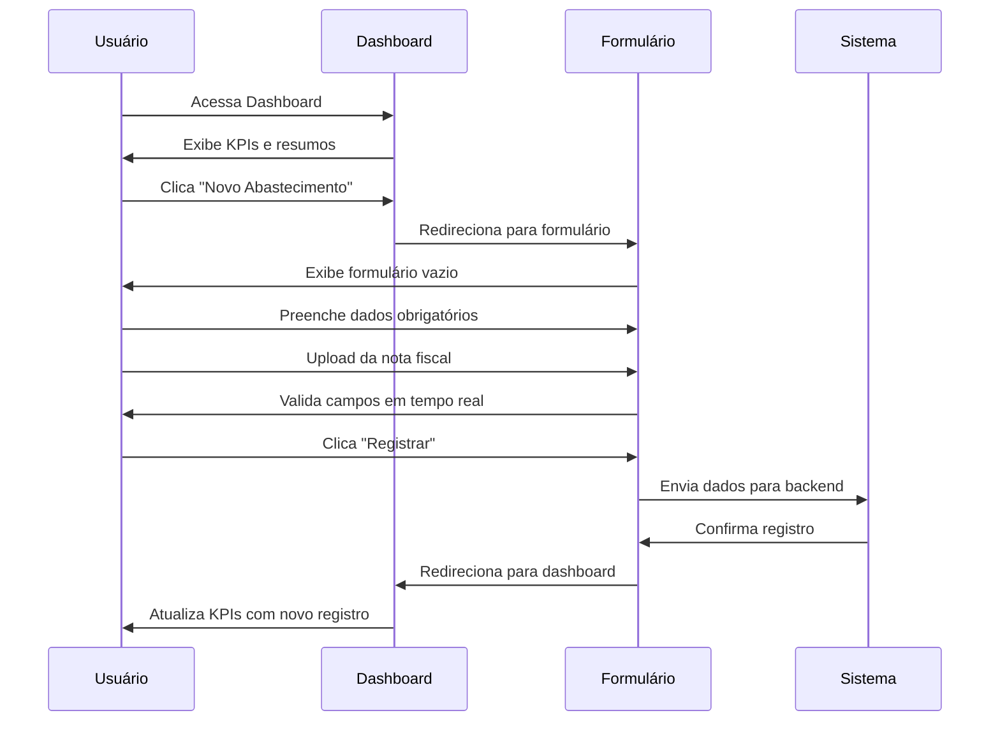

# Documentação - Sistema de Automação de Abastecimento de Frotas

## Propósito
Este diretório contém toda a documentação técnica e funcional do projeto de automação de abastecimento de frotas. A documentação é essencial para:
- **Entendimento do Sistema**: Visão completa da arquitetura e funcionalidades
- **Onboarding**: Facilitar a integração de novos desenvolvedores
- **Manutenção**: Documentação de decisões técnicas e padrões
- **Referência de API**: Especificações detalhadas dos endpoints
- **Diagramas e Fluxos**: Visualização da arquitetura e processos

## Estrutura Planejada
```
src/docs/
├── architecture/        # Documentação de arquitetura
│   ├── system-design.md  # Design geral do sistema
│   ├── database-schema.md # Esquema do banco de dados
│   └── diagrams/         # Diagramas UML, C4, etc.
├── api/                 # Documentação da API
│   ├── endpoints.md      # Lista de endpoints
│   ├── authentication.md # Autenticação e autorização
│   └── examples.md       # Exemplos de uso
├── frontend-web/        # Docs do frontend web
│   ├── components.md     # Componentes e estrutura
│   ├── screens.md        # Telas e fluxos
│   └── wireframes/       # Wireframes e mockups
├── frontend-mobile/     # Docs do frontend mobile
│   ├── screens.md        # Telas e navegação
│   ├── features.md       # Funcionalidades específicas
│   └── mockups/          # Mockups das telas
├── business/            # Regras de negócio
│   ├── requirements.md   # Requisitos funcionais
│   ├── user-stories.md   # Histórias de usuário
│   └── workflows.md      # Fluxos de trabalho
├── deployment/          # Deploy e infraestrutura
│   ├── setup.md          # Configuração inicial
│   ├── ci-cd.md          # Pipeline CI/CD
│   └── environments.md   # Ambientes (dev, staging, prod)
├── guides/              # Guias e tutoriais
│   ├── contributing.md   # Como contribuir
│   ├── coding-standards.md # Padrões de código
│   └── testing.md        # Guia de testes
└── README.md            # Este arquivo
```

## Tipos de Documentação
### 1. Documentação Técnica
- Arquitetura do sistema
- Diagramas de classes, sequência e componentes
- Especificações de API (Swagger/OpenAPI)
- Schema do banco de dados
- Fluxos de dados

### 2. Documentação Funcional
- Requisitos do sistema
- Histórias de usuário
- Casos de uso
- Regras de negócio
- Fluxos de processos

### 3. Documentação de Interface
- Wireframes
- Mockups
- Design System
- Guia de estilos
- Prototipação interativa

### 4. Guias de Desenvolvimento
- Setup do ambiente
- Padrões de código
- Convenções de commits
- Guia de contribuição
- Boas práticas

## Diagramas a Serem Criados
1. **Diagrama de Contexto (C4)**: Visão geral do sistema
2. **Diagrama de Container**: Componentes principais
3. **Diagrama de Componentes**: Estrutura interna
4. **Diagrama ER**: Modelo de dados
5. **Diagramas de Sequência**: Fluxos principais
   - Registro de abastecimento
   - Autenticação de usuário
   - Geração de relatórios
6. **Diagramas de Caso de Uso**: Interações do usuário
7. **Fluxogramas**: Processos de negócio

## Wireframes das Telas Principais

### 1. Painel Geral (Dashboard)



**Descrição do Layout - Painel Geral:**
- **Header**: Barra superior com logo, título do sistema e menu do usuário
- **Menu Lateral**: Navegação principal fixa com ícones e labels
- **Área de KPIs**: Cards com métricas importantes (4 principais)
- **Seção de Gráficos**: Dois gráficos principais lado a lado
- **Área de Resumos**: Lista dos últimos abastecimentos e área de alertas

### 2. Registro de Abastecimento



**Descrição do Layout - Registro de Abastecimento:**
- **Seção Identificação**: Campos básicos para identificar o veículo e contexto
- **Seção Dados**: Formulário principal com todos os campos do abastecimento
- **Seção Documentação**: 
  - Área de upload com drag & drop para nota fiscal
  - Botão para scanner QR Code da nota fiscal
  - Preview do arquivo enviado
- **Botões de Ação**: Três opções (Cancelar, Salvar como Rascunho, Registrar)

### 3. Fluxo de Interação Principal



## Ferramentas Sugeridas
- **Diagramas**: Draw.io, Lucidchart, PlantUML, Mermaid
- **Mockups**: Figma, Adobe XD, Sketch
- **API Docs**: Swagger UI, Postman
- **Colaboração**: Notion, Confluence, GitHub Wiki

## Como Contribuir com a Documentação
1. Mantenha a documentação sempre atualizada
2. Use linguagem clara e objetiva
3. Inclua exemplos práticos quando possível
4. Mantenha diagramas versionados junto ao código
5. Revise periodicamente para garantir precisão

## Status
✅ **Wireframes Básicos** - Adicionados diagramas iniciais para Painel Geral e Registro de Abastecimento
🚧 **Em construção** - Aguardando documentação detalhada e implementação
