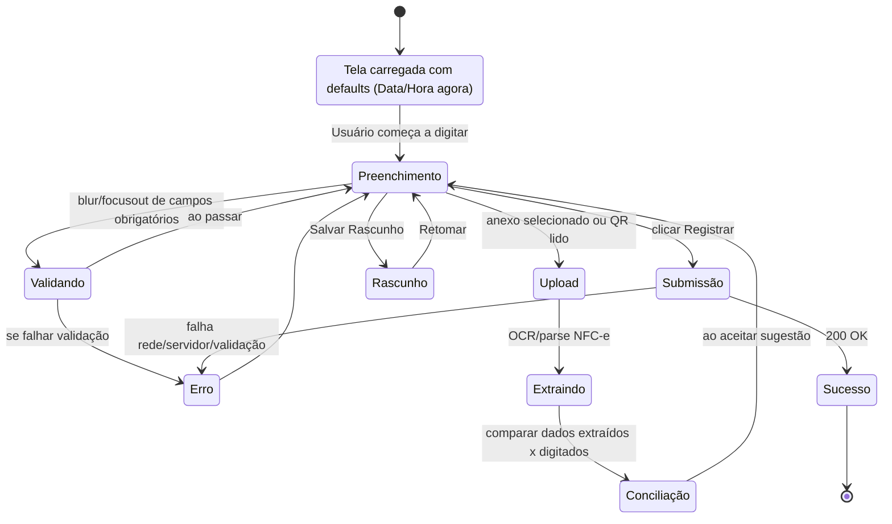

# Documentação - Sistema de Automação de Abastecimento de Frotas

## Wireframe: Registro de Abastecimento

Este documento descreve a tela e o fluxo completo para o registro de um novo abastecimento. Inclui estrutura de layout, estados de UI, validações, acessibilidade, responsividade e um diagrama Mermaid do wireframe e do fluxo.

### Objetivos da Tela
- Permitir registrar rapidamente um abastecimento com dados confiáveis e auditáveis
- Minimizar erros por meio de validações em tempo real e máscaras
- Suportar anexos (nota fiscal/QR Code) e preview
- Oferecer rascunho e retomada do preenchimento

### Estrutura do Layout
- Header
  - Título: “Registro de Abastecimento”
  - Breadcrumb: Início > Abastecimentos > Novo
  - Ações rápidas: Ajuda (?) e Atalhos (teclado)
- Identificação do veículo
  - Campos: Placa/Identificador, Frota (opcional), Motorista (selecionável), Odômetro atual
  - Busca assistida por autocomplete e scanner de QR interno (se disponível)
- Campos de dados do abastecimento
  - Data/Hora, Litros, Valor Total, Preço por Litro (calculado), KM (odômetro), Posto
  - Método de pagamento (opcional): Cartão frota, Pix, Dinheiro, Outros
  - Observações (opcional)
- Upload de nota fiscal / QR Code
  - Arrastar e soltar, selecionar arquivo, ou ler QR Code (texto DANFE/URL NFC-e)
  - Suporte: PDF, JPG, PNG, XML (NFC-e)
- Área de preview
  - Miniatura/iframe do anexo; extrações detectadas (CNPJ, número da NF, data, valor, litros) com status de confiança
- Barra de ações
  - Cancelar, Salvar Rascunho, Registrar

### Wireframe (Mermaid)
```mermaid
flowchart TB
  subgraph Header
    H1[Registro de Abastecimento]
    H2[Breadcrumb: Início > Abastecimentos > Novo]
    H3[(Ajuda / Atalhos)]
  end

  subgraph Identificação do Veículo
    V1[Placa / Identificador (autocomplete)]
    V2[Motorista (select/search)]
    V3[Odômetro atual (km)]
  end

  subgraph Dados do Abastecimento
    D1[Data/Hora]
    D2[Litros]
    D3[Valor Total]
    D4[Preço por Litro (auto = Valor/Litros)]
    D5[KM (odômetro)]
    D6[Posto (select)]
    D7[Método de pagamento (opcional)]
    D8[Observações (opcional)]
  end

  subgraph Anexos
    U1[Upload Nota Fiscal: PDF/JPG/PNG/XML]
    U2[Ler QR Code / Colar chave de acesso]
    U3[Preview + Extração: CNPJ, NF, Data, Valor, Litros]
  end

  subgraph Ações
    A1((Cancelar))
    A2((Salvar Rascunho))
    A3((Registrar))
  end

  H1 --> Identificação do Veículo --> Dados do Abastecimento --> Anexos --> Ações
  D2 --> D4
  D3 --> D4
```

### Fluxo e Estados (Mermaid)


### Campos e Regras de Validação
- Placa/Identificador: obrigatório; máscara AAA0A00 ou AAA-0A00 (BR) quando aplicável; autocomplete
- Motorista: obrigatório; select com busca; exibe documento/ID no tooltip
- Odômetro atual (km): obrigatório; inteiro >= último registrado; aviso se variação > limites definidos
- Data/Hora: obrigatório; não pode ser futuro além de +5 min; dentro do período de operação
- Litros: obrigatório; número > 0; 2 ou 3 casas decimais; limite máximo por veículo
- Valor Total: obrigatório; > 0; moeda com máscara; compatível com litros e preço/litro
- Preço por Litro: calculado automaticamente; pode ser editável sob permissão; valida faixa por região/posto
- KM (odômetro): alias de Odômetro atual; manter consistência
- Posto: obrigatório; select; mostrar CNPJ/cidade
- Método de pagamento: opcional; se “Cartão frota”, solicitar número parcial (****1234)
- Observações: opcional; 0-500 caracteres

Dependências e consistência:
- D4 = D3 / D2 com arredondamento; se usuário editar D4, recalcular D3 quando D2 mudar
- Alertar consumo anômalo: (litros / km percorridos desde último abastecimento) fora da faixa

### Acessibilidade (A11y)
- Labels explícitos e for/id; aria-describedby para mensagens de erro e dicas
- Navegação por teclado completa; ordem lógica; atalhos: Alt+S (Salvar Rascunho), Alt+R (Registrar), Esc (Cancelar)
- Contraste AA; foco visível; tamanho de alvo mínimo 44x44 px
- Leitores de tela: anunciar sucessos/erros via aria-live=polite/assertive
- Modo alto contraste e prefer-reduced-motion respeitados

### Mensagens de Erro/Sucesso
- Inline por campo (texto curto) e banner no topo
- Exemplos:
  - Erro: “Litros deve ser maior que 0.”
  - Erro: “Odômetro inferior ao último registro (123.456 km).”
  - Aviso: “Preço/Litro fora da faixa média da região.”
  - Sucesso: “Abastecimento registrado com sucesso.”
  - Rascunho: “Rascunho salvo.”

### Responsividade
- Desktop: layout em 2 colunas (Identificação + Dados); Anexos à direita com preview
- Tablet: 1-2 colunas fluidas; ações fixas no rodapé
- Mobile: 1 coluna; grupos colapsáveis; botões em full-width; upload com câmera

### Controles e Interações
- Máscaras: placa, moeda, número; normalização de separador decimal
- Autocomplete: placa, posto, motorista; setas + Enter; mostrar 5-10 sugestões
- Upload: drag & drop; múltiplos formatos; progresso e opção remover/substituir
- Preview: thumbnail/iframe; botão “Extrair dados” e “Aplicar ao formulário”
- Botões de ação:
  - Cancelar: confirma descarte se houver alterações não salvas
  - Salvar Rascunho: salva parcial com status “rascunho” e timestamp
  - Registrar: valida tudo; bloqueia duplo clique; mostra spinner e estado desabilitado

### Telemetria e Auditoria
- Log de alterações de campos-chave (antes/depois) em submissão
- Origem do dado (manual x extraído x sugerido) por campo
- Hash do anexo para deduplicação

### Requisitos Funcionais
- Cálculo automático preço/litro e validações cruzadas
- Preenchimento guiado por dados extraídos da NF/QR
- Suporte offline (opcional) com sincronização de rascunhos
- Permissões por papel: edição de preço/litro, exclusão, reprocessar extração

### Testes de Aceitação (exemplos)
- Deve impedir registro com odômetro menor que o último
- Deve calcular preço/litro com 3 casas e arredondar corretamente
- Deve permitir upload de XML NFC-e e extrair CNPJ e valores
- Deve salvar e recuperar rascunho com todos os campos
